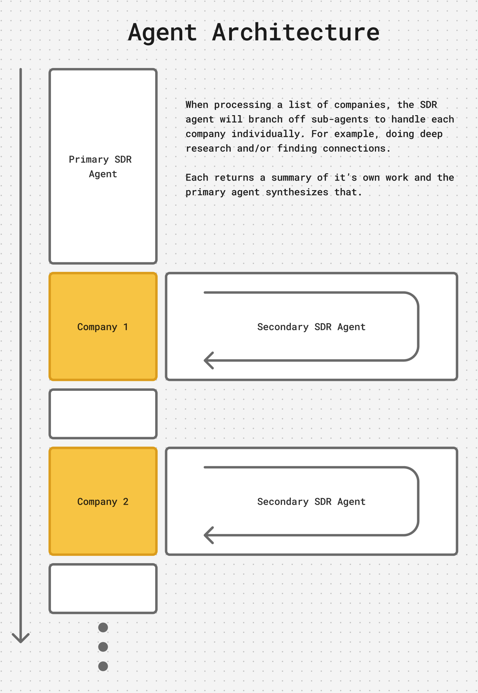

OpenSDR helps you research companies and find people on LinkedIn, automating the tedious aspects of lead generation.


## Getting Started

1. **Install Open-SDR:**
   ```
   npm install -g open-sdr
   ```

2. **Login to LinkedIn:**
   ```
   sdr login
   ```
   This will open LinkedIn in a browser for you to login. Open-SDR will use this browser session for its operations.

3. **Set up API keys:**
   Create a `.env` file with your API keys:
```
FIRECRAWL_API_KEY=<your key>
GOOGLE_GENERATIVE_AI_API_KEY=<your key>
ANTHROPIC_API_KEY=<your key>
RIME_API_KEY=<> (optional)
```

## How to use OpenSDR

OpenSDR can be used in 2 ways:
- `sdr agent` - A stand-alone agent via commandline interface (CLI) that is an MCP client.
- `sdr server` - An MCP server that gives tools for research and lead generation to other MCP clients.


### Available Tool Commands

All of the tools OpenSDR agent has are available via `sdr tools <command>`. You can provide these tools to another MCP client using `sdr server`.

#### Tool Details

- **findLinkedinConnectionsAt**: Find first or second-degree connections at a specific company
  ```
  sdr tools findLinkedinConnectionsAt --companyName="Company Name" --degree="first|second"
  ```

- **findProfile**: Find a LinkedIn profile by name, optionally filtered by company
  ```
  sdr tools findProfile --personName="Person Name" [--companyName="Company Name"]
  ```

- **findMutualConnections**: Find mutual connections with a person on LinkedIn
  ```
  sdr tools findMutualConnections --personName="Person Name" [--companyName="Company Name"]
  ```

- **draftMessage**: Open browser to draft a message to a LinkedIn connection
  ```
  sdr tools draftMessage --profileUrl="https://linkedin.com/in/profile" --message="Your message"
  ```

- **researchCompany**: Gather comprehensive background information about a company
  ```
  sdr tools researchCompany --companyName="Company Name" [--companyContext="They are an AI startup"] [--peopleGuidance="Focus on engineers"]
  ```

- **deepResearch**: Perform deep research on a topic using Firecrawl
  ```
  sdr tools deepResearch --query="Research topic" [--maxDepth=5] [--timeLimit=180] [--maxUrls=15]
  ```

- **runAgentOnEachCompany**: Run the SDR agent for each company mentioned in a prompt
  ```
  sdr tools runAgentOnEachCompany --prompt="Your prompt with multiple companies"
  ```

- **writeSdrNotes**: Write markdown content to a file in the SDR notes directory
  ```
  sdr tools writeSdrNotes --content="Markdown content" [--filename="notes"] [--subdirectory="research"]
  ```

## Standalone Agent

Open-SDR provides several command-line tools:

```
sdr tools <command> # Run specific tools directly
sdr agent <promptFile>  # Run an agent with a prompt file
```

### Sample prompts

There are sample prompts in the `sample_prompts` directory. 


### Agent Architecture



The Open-SDR agent will operate in a single context and can spawn sub-agents per company to ensure comprehensive research and efficient use of context.

### MCP Client

The standalone agent is an MCP which means it can integrate tons of other capabilities. See [PulseMCP](https://www.pulsemcp.com/) to find example servers.

This is configurable from `mcp.json`

By default the agent comes with  **Rime** installed for text-to-speech to notify of progress but this can be disabled.

### Potential Integrations ideas

Open-SDR could be extended to work with:

- **Google Sheets**: Store company, person, and warm intro data
- **Apollo**: Add email enrichment services
- **Notion**: Store and organize research findings
- **Slack**: Share briefings and research summaries

## MCP Server

Open-SDR implements the Model Context Protocol (MCP) server, allowing you to use its tools with compatible AI systems.

To start the server:
```
sdr server
```

This will output an MCP config JSON object you can use to configure an MCP client.


## Built with Ref

Built with [ref.tools](https://ref.tools)

## License

MPL 2.0

